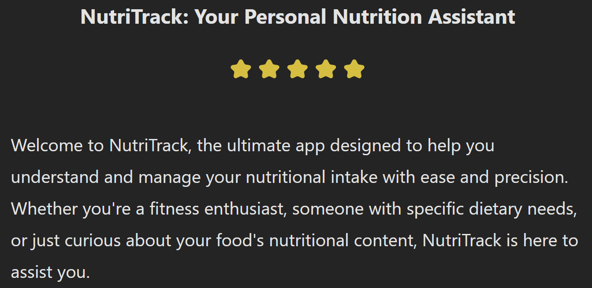
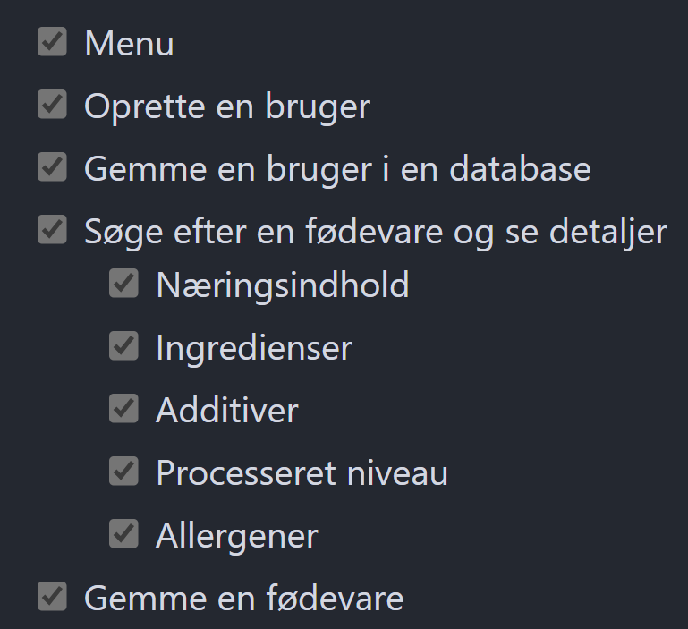

### 🍦ICE 

%%
Frederik
%%

---
### 📋Funktionelle krav

#### ✅Must-have

%%
Emil
%%

---
### 📋Funktionelle krav

#### ✅Must-have

![[Pasted image 20241217130114.png|700]](Pasted image 20241217130114.png)

%%
Emil
%%

---
### 📋Funktionelle krav

#### 🌟Nice-to-have

![[Pasted image 20241217130144.png|400]]

%%
Thomas
%%

---
### 🌍Domæne model

%%
Abbas
%%

---

### 🔷Klasse diagram

%%
Abbas
%%

---
### 📊Entity relation diagram

%%
Abbas
%%

---
### 💻Kode eksempler

![[Pasted image 20241217114847.png]](Pasted image 20241217114847.png)

%%
Alissa
%%

---
### 💻Kode eksempler

![[Pasted image 20241217114912.png]](Pasted image 20241217114912.png)

%%
Alissa
%%