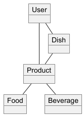
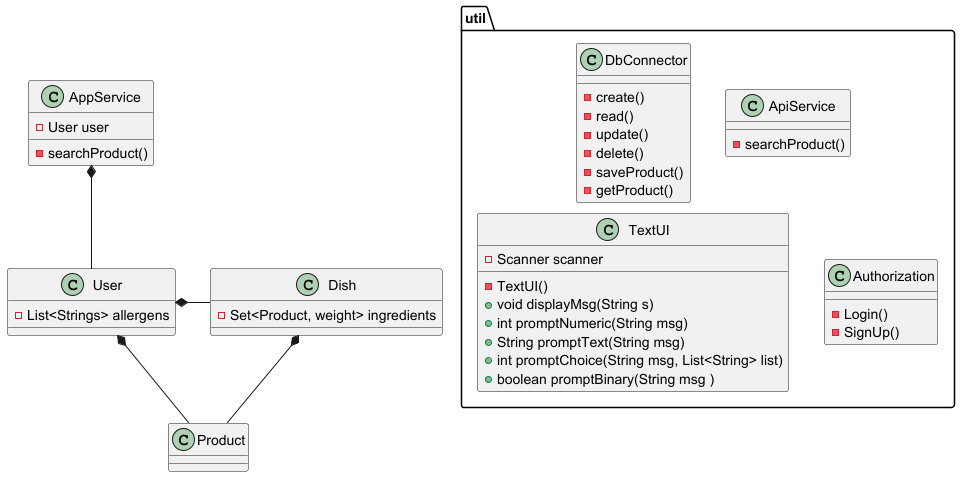
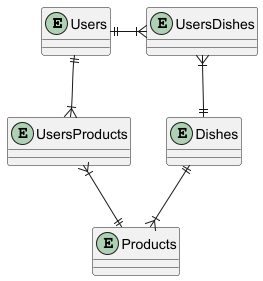

### 🍦ICE 

%%
Frederik
%%

---
### 📋Funktionelle krav

#### ✅Must-have

%%
Emil
%%

---
### 📋Funktionelle krav

#### ✅Must-have

%%
Emil
%%

---
### 📋Funktionelle krav

#### 🌟Nice-to-have

%%
Thomas
%%

---
### 🌍Domæne model

%%
Abbas
%%

---

### 🔷Klasse diagram

%%
Abbas
%%

---
### 📊Entity relation diagram

%%
Abbas
%%

---
### 💻Kode eksempler

%%
Alissa
%%

---
### 💻Kode eksempler

%%
Alissa
%%